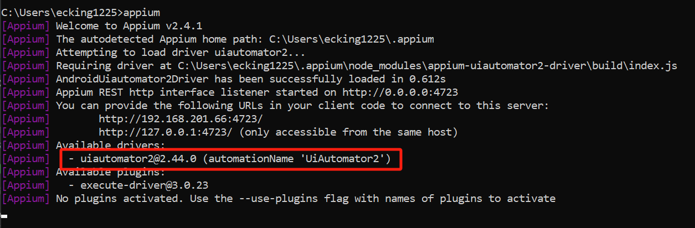

# Api And Mobile Test

This project is based on Appium mobile test automation framework with Page Object Model design using Java + Cucumber + Maven + JUnit + Rest assured.
Framework follows many of the industry best practices and supports Android in a single code base.

# Technologies/Tools used in building the framework

- IntelliJ - IDE
- Appium - Mobile automation library
- Maven - Build automation tool
- Java - Programming language
- Cucumber - BDD
- Gherkin - DSL
- JUnit - Unit testing framework
- Log4J - Logging framework
- Extent Reports - Reporting framework
- JSON - Test Data
- XML - Static text
- GitHub - Version control
- Jenkins - CI/CD (optional)
- Rest Assured - Restful API automation library

# Framework implements below best practices

- Code reusability and readability
- Scalable automation (demonstrated using multiple test classes)
- Uses explicit waits
- Abstraction layer for UI commands like click, sendkeys, etc.
- Abstraction layer for test data
- Abstraction layer for static text
- Supports Android
- How to recover from test failure/ how to write fail safe test cases
- Easy to expand and maintain
- Supports parallel execution using JUnit
- Supports execution on real Android
- Start Appium server programmatically
- Supports Cucumber-HTML-Reporter plugin
- Integrated with Log4J2 Logging framework

# Test Procedure

1. Setup JDK 1.8 or above and set related config in "System Variables".

2. Setup Android SDK r24.4.1 

   1. Install packages as below via "SDK Manager"

      

      

      

   2. Config [ANDROID_HOME] and add [%ANDROID_HOME%\tools;%ANDROID_HOME%\platform-tools;%ANDROID_HOME%\build-tools\29.0.3;] to variable "Path" in "System Variables".

3. Setup Appium

   1. Appium Installation Command: npm install -g appium
   2. Appium driver Installation Command: appium driver install uiautomator2
   3. Result Check
      

4. Setup NodeJs and add config to the variable "Path" in system variables

5. Install Nox Simulator for Android, and replace "adb.exe“ of Nox Simulator with the one from Android SDK (in the catalog of platform-tools)

6. Check connection between SDK and Nox Simulator

   1. Command: adb devices

      

7. Setup Maven and add config the variable "Path" in system variables

8. Start Nox Simulator, navigate to this project directory and run test via command "mvn clean test"

9. After all test execution is done, you could see detailed test report in catalog "target".
   

10. You could check related test cases loacated at "/QaHomework/tree/main/src/test/resources".

   
